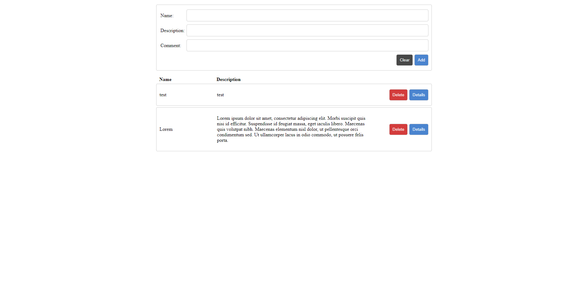
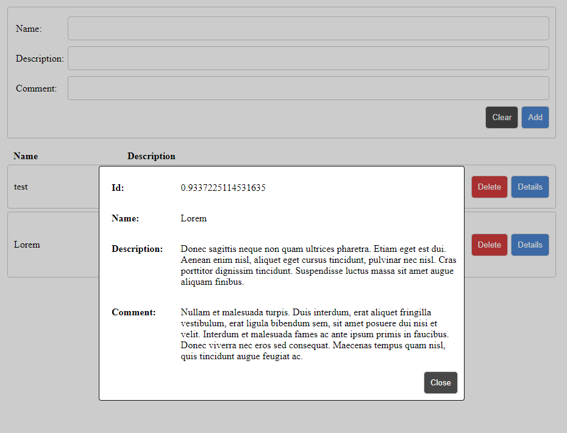

# React challenge

React challenge for Jubic that saves form information to localStorage using Redux. Forms can be deleted from localStorage and details popup shows all form information. State is managed by Redux store and reducer.

## Frontpage

## Form details popup

