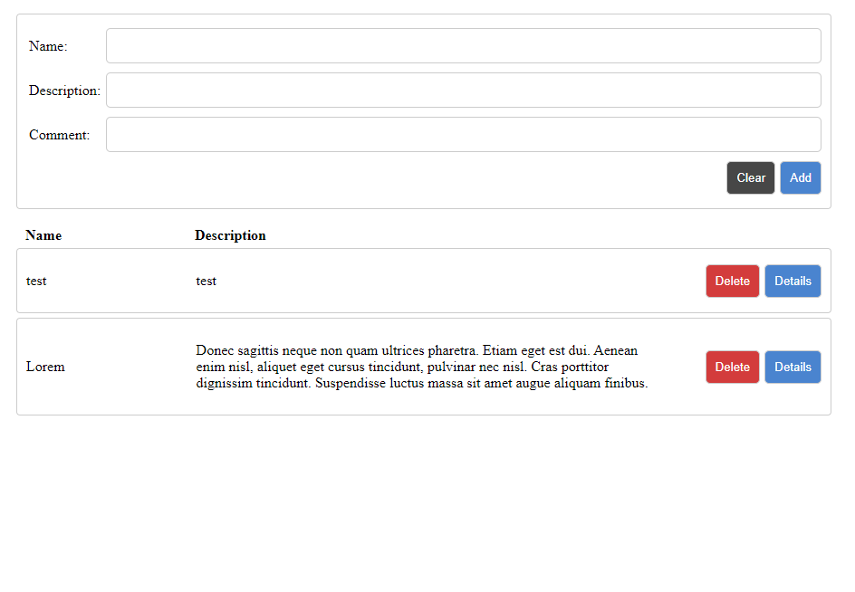

# React challenge

React challenge for Jubic that saves form information to localStorage using Redux. Forms can be deleted from localStorage and details popup shows more all form information.

## Frontpage

## Form details popup

